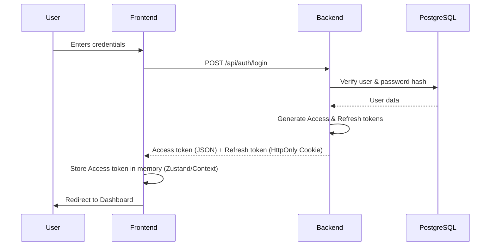
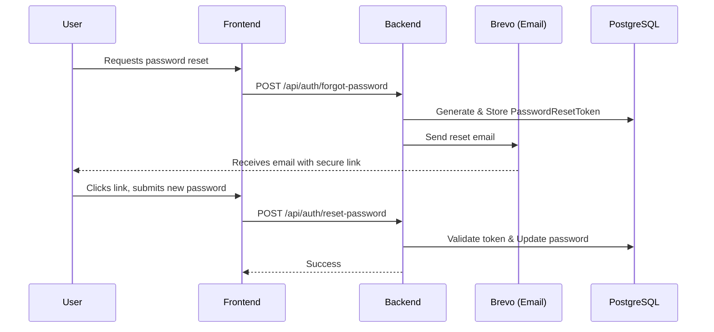
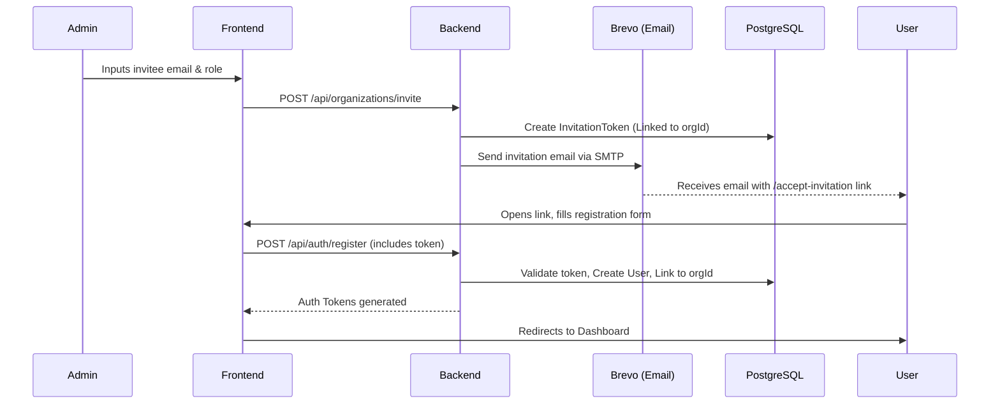
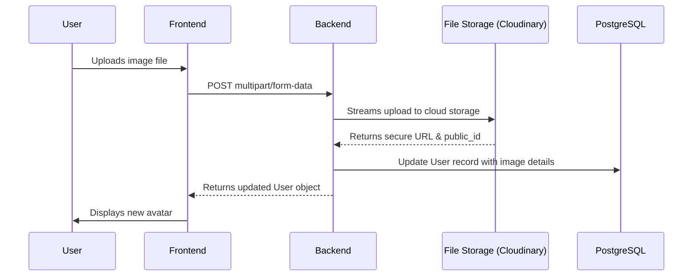
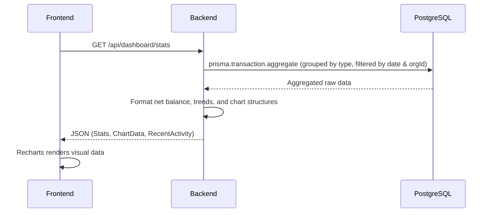
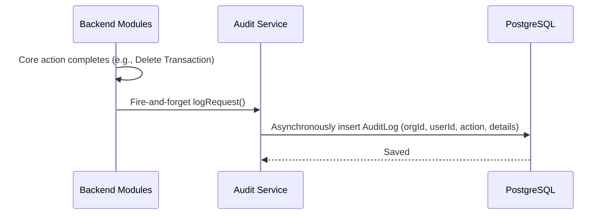
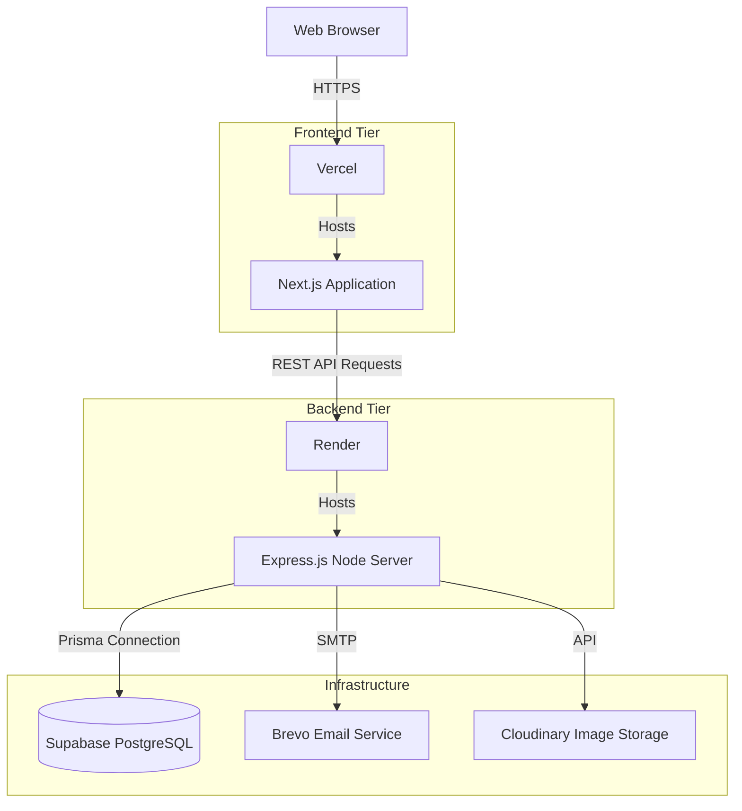

# Fintriq System Architecture

This document outlines the detailed architecture, data flows, and technical decisions of the Fintriq platform.

## System Architecture

### Frontend
- **Framework:** Next.js 14 (App Router)
- **PWA:** next-pwa (Offline support and installability)
- **State Management:** React Query (Server state), React Context (Local state)
- **Styling:** Tailwind CSS, Shadcn UI (Accessible, customizable components)
- **Data Visualization:** Recharts (Responsive, animated financial charts)
- **Testing:** Jest + React Testing Library (Isolated tsconfig scopes)

### Backend
- **Framework:** Express.js
- **Language:** TypeScript
- **ORM:** Prisma
- **Validation:** Zod (Request payload schemas)
- **Testing:** Jest (Supertest API integration ready)

### Database
- **Engine:** PostgreSQL
- **Host:** Supabase
- **Structure:** Multi-tenant (all major entities are scoped via an enforced `orgId`)

---

## Data Flows

### Authentication Flow

Fintriq uses a robust dual-token mechanism. Access tokens are stored ephemerally in memory to prevent XSS, while refresh tokens are secured in `HttpOnly` cookies.



### Password Reset Flow



### Invitation Flow

Fintriq allows Admins to securely onboard new team members to their isolated organization workspace.



### Profile Picture Flow



### Dashboard Analytics Flow

The dashboard requires rapid aggregation of organizational data.



### CSV Export Flow

Generating robust financial reports securely.

```mermaid
sequenceDiagram
    participant F as Frontend
    participant B as Backend
    participant DB as PostgreSQL
    
    F->>F: Compiles active filters (search, dates, category)
    F->>B: GET /api/transactions/export (with query params)
    B->>DB: Run aggregate calculations (Total Income/Expense)
    B->>B: Set Content-Disposition (attachment; filename=...)
    B->>B: Write CSV Header block
    loop Over 1000 records batch
        B->>DB: Fetch batch of filtered transactions
        B->>B: Format row and stream to HTTP response
    end
    B-->>F: Complete File Blob
    F->>F: Triggers browser download prompt
```

### Audit Log Flow

Ensuring compliance and accountability across the platform.



---

## Deployment Architecture

Fintriq uses a decoupled, modern serverless/PaaS deployment architecture for optimal scaling and minimal DevOps overhead.



### Deployment Configuration Highlights
- **Vercel:** Automates frontend builds directly from the GitHub repository (`main` branch).
- **Render:** Utilizes a `render.yaml` configuration file as infrastructure-as-code for the backend API.
- **Supabase:** Provides highly available PostgreSQL with automated backups. Database migrations are applied automatically during the Render build step via `npx prisma migrate deploy`.
